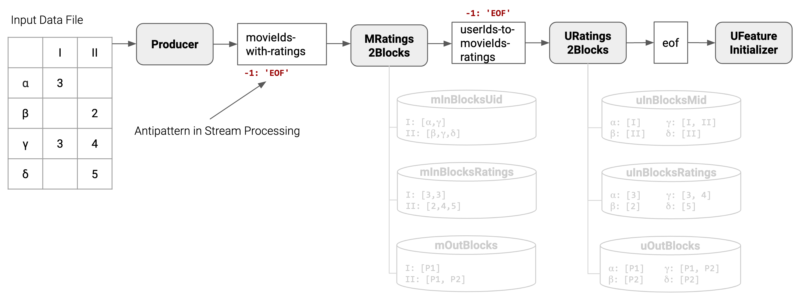
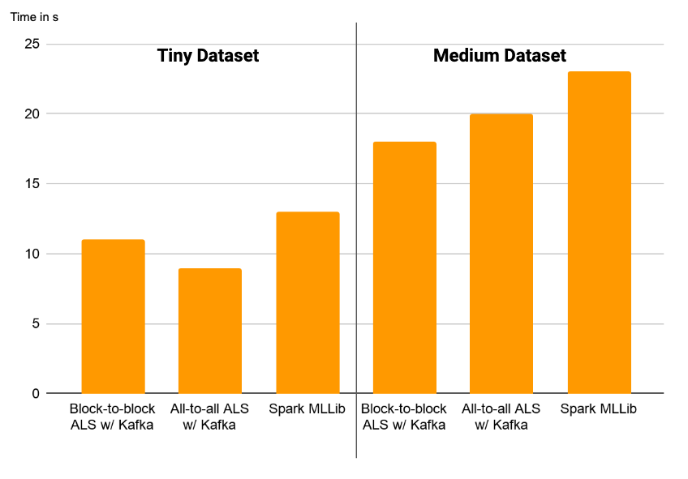

# Collaborative Filtering using Alternating Least Squares in Apache Kafka

We used Apache Kafka's Processor API to implement a prototype for collaborative filtering using alternating least squares (ALS). Our implementation is based on concepts from the work of Das et al. (2017) which is already a part of [Apache Spark's MLLib](https://spark.apache.org/docs/latest/mllib-collaborative-filtering.html).

## Prerequisites

- Java JDK 8 or higher
- Docker and Docker-Compose
- We used IntelliJ IDEA for development

## Test Datasets

We created three test datasets of different sizes that are samples from the dataset made public as part of the Netflix prize challenge. The full datasets can be downloaded from [Kaggle](https://www.kaggle.com/netflix-inc/netflix-prize-data). Our three test datasets are part of this repository to get started easily.

The options needed for testing the app for the three different test datasets are:

Dataset path | NUM_MOVIES | NUM_USERS
--- | ---: | ---:
`./data/data_sample_tiny.txt` | 426 | 302
`./data/data_sample_small.txt` | 2062 | 1034
`./data/data_sample_medium.txt` | 3590 | 2120

## Getting Started

To start the confluence Kafka docker image execute the following:

`(cd dev && docker-compose down -v && docker-compose up)`

Wait for the broker, zookeeper and control center to be up and running. You can find the control center at [http://0.0.0.0:9021/](http://0.0.0.0:9021/).

Run `./setup.sh NUM_PARTITIONS NUM_ITERATIONS` (e.g. `./setup.sh 4 10`) to (re)create necessary topics that cannot be automatically created.

To run the app, run `./gradlew run --args='NUM_PARTITIONS NUM_FEATURES LAMBDA NUM_ITERATIONS PATH_TO_DATASET NUM_MOVIES NUM_USERS'`, e.g. `./gradlew run --args='4 10 0.05 10 ./data/data_sample_tiny.txt 426 302'`.

The app outputs a prediction matrix which is dumped as a CSV to `./predictions/` with a timestamp. The quality of the predictions can be checked using a small script to calculate the mean squared error (MSE) between the ratings given in the original ratings matrix and the approximate ratings from the prediction matrix. For the example from above, run `python ./scripts/calculate_mse.py ./data/data_sample_tiny.txt ./predictions/prediction_matrix_2020-03-15\ 19:39:33.127` to calculate the MSE.

## Introduction

Collaborative filtering is a technique in which feedback from users for items (e.g. movies, songs, clothing) is used to predict how others users would rate these items.
This plays a major role for many companies that deal with huge user-item datasets and want to make recommendations for these users, e.g. Netflix, Spotify or Amazon.
We focus on explicit feedback, which means analysing explicit ratings from users instead of implicit measurements like "time spent viewing item x" or mouse movements.
We use movies as an example for items throughout our project.
The problem can be imagined as a big matrix where the users are represented by the rows and the items are represented by the columns (see below).
Some cells of the matrix contain ratings, but the majority of the cells are empty making the matrix very sparse in practice. The idea of collaborative filtering is to fill these empty cells with could-be ratings that can be used to recommend an item to a user. To facilitate this, collaborative filtering usually makes use of matrix factorization.

RatingsMatrix | Movie1 | Movie2 | Movie3 | Movie4
--- | ---: | ---: | ---: | ---:
User1 | null | 1 | null | 5
User2 | 2 | 3 | null | null
User3 | null | null | null | 4
User4 | 2 | null | 3 | null

## Alternating Least Squares

The algorithm we implemented to do matrix factorization is the alternating least squares method (ALS).
Netflix once started [a challenge](https://www.netflixprize.com/assets/rules.pdf) with the goal of improving its prediction system.
The winning solution used a number of different approaches and ALS was one of them.
A detailed explanation can be found in the original publication from Zhou et al. (2008).

Generally, collaborative filtering makes use of matrix factorization. ALS is a way to factorize a particularly sparse matrix because other factorization methods such as _Singular Value Decomposition_ cannot be applied to a sparse matrix.
ALS finds two low-rank matrices (to save storage and computing power) whose multiplication approximates the original matrix. The multiplication of these two low-rank matrices then also contains ratings in previously empty cells which can be used for recommendations.
These two low-rank approximation matrices could look like this, the values aren't correct in this example:

UserFeatureMatrix | Feature1 | Feature2
--- | ---: | ---:
User1 | 1.3 | 1.5
User2 | 2.0 | 3.2
User3 | 1.5 | 0.4
User4 | 2.4 | 4.2

MovieFeatureMatrix | Feature1 | Feature2
--- | ---: | ---:
Movie1 | 2.3 | 4.5
Movie2 | 2.2 | 1.2
Movie3 | 1.0 | 3.4
Movie4 | 2.6 | 3.2

These matrices would be multiplied to get the final prediction matrix.

To calculate these two feature matrices, ALS needs an error function.
We are using a very similar function as the one described by Zhou et al. (2008):

We calculate the _RMSE_ between all cells that contain ratings in the original ratings matrix (rij) and the corresponding cells of the prediction matrix (uiTmj, where ui and mj are vectors of the respective feature matrices).
As we are using low-rank approximations, it is very unlikely that ALS will correctly "predict" the original ratings.
The paper then normalizes the RMSE with a parameter _lambda_ and, depending on the cell, with the number of ratings of the corresponding user and movie (nui and nmj).
In our approach, we also normalize with _lambda_, but depending on the step we are in (see below), we only have access to the number of ratings of the user or the movie respectively.
We only use this number to normalize multiplied with lambda in contrast to both as shown above.

### ALS Algorithm
We describe the steps of the algorithm schematically.
For the detailed mathematical explanation we refer to Zhou et al. (2008).

#### 0. Initialize _UserFeatureMatrix_
Initialize the _UserFeatureMatrix_ with small random values in (0,1].

_UserFeatureMatrix_ | Feature1 | Feature2
--- | ---: | ---:
User1 | 0.3 | 0.5
User2 | 0.0 | 0.2
User3 | 0.5 | 0.4
User4 | 0.4 | 0.2

#### 1. Calculate _MovieFeatureMatrix_
We fix the _UserFeatureMatrix_ from Step 0 for this step.
We get a closed form solution for the _MovieFeatureMatrix_ by calculating the partial derivative of the error function for all features for a movie j.
This leads to the following equation for the features of movie j:

Ij is the set of all users with ratings for that movie j, so UIj is the matrix of all features of all users with ratings for that movie j.
R(Ij,j) is the vector of all preexisting ratings for that movie j.

As we can see, the features being calculated only depend on a small row of the original matrix and a subset of all user features.

#### 2. Calculate _UserFeatureMatrix_
Now we fix the _MovieFeatureMatrix_ and calculate the _UserFeatureMatrix_ from the error function, this step is symmetric to step 1.

#### 3. Repeat step 1 and 2 for a number of iterations
Experiments conducted by Zhou et al. (2008) have shown that even for the largest datasets this algorithm converges in 5 - 20 iterations of these two steps.
We configure a fixed number of iterations in the beginning and repeat accordingly.

#### 4. Calculate predicitions
In the end, we need to calculate the _FinalPredictionMatrix_ by multiplying the two feature matrices:

_FinalPredictionMatrix_ = _UserFeatureMatrix_ * _MovieFeatureMatrix_T

This yields an approximation of the original _RatingsMatrix_ which now contains predictions for the previously empty cells.

## Distributing ALS

As discussed in the section on ALS, the features of a single user/movie can be updated using a closed form solution.
Therefore, this part can be intuitively parallelized so that in a distributed computing setting, we focus on reducing the communication cost.
To be able to update a user's feature vector, the following data is required: a) the **ratings the user has given** to movies and b) a **movie feature sub-matrix** for the movies the user has rated.
To be more precise, this is a sub-matrix of the matrix that all movie feature vectors make up together.
The **ratings the user has given** are constant throughout the ALS process and can therefore be stored on a single node for the whole execution of the algorithm.
It does not have to be transferred between nodes during ALS iterations.
The values of the **movie feature sub-matrix** change during execution of the algorithm towards a best-possible low-rank approximation of the original matrix.
However, the structure of this sub-matrix stays the same because the movies a user has rated stay the same during runtime.
We can use this fact to our advantage for distributing ALS.

### Concepts introduced by Das et al. (2017)

Translating our observations from above into concepts, we create a so called _InBlock_ and an _OutBlock_ for every feature vector _User1, User2, ..., UserN_ and _Movie1, Movie2, ..., MovieN_ that we want to compute in an iteration.
We now look at _InBlocks_ and _OutBlocks_ from the perspective of a feature vector computation for a user feature vector.
Each _InBlock_ stores the ratings the user has given to movies and the IDs of these movies which allows us to access these movies' feature vectors.
Each _OutBlock_ stores the IDs of movie feature vectors that depend on the currently computed user feature vector for computation. In the case of the block-to-block join, an _OutBlock_ of a user feature vector is used to send the feature vector once per partition that contains dependent movie feature vector computations. However in the case of the more naive all-to-all join, the _OutBlock_ is not used and a user feature vectors is sent once per depending movie feature vector, even if multiple movie feature vector computations would be carried out on the same partition.

## Reference Implementation in Spark

The algorithm by Das et al. (2017), which is based on the concepts introduced above, is implemented in Apache Spark's MLLib. It makes some additional important optimizations for distributed calculation of ALS, as the partial data handled in each ALS step can grow very large.

The implementation takes pressure of the Java garbage collector by using primitive arrays instead of tuples of integers and optimizes the memory footprint of ALS by using smaller arrays and packing multiple values in a single integer.
In addition to greatly optimizing the memory consumption, the main takeaway is their approach to handling the communication of a distributed ALS approach which we based our solution upon as well.

## Implementation in Kafka

Our Kafka app can be devided into _InBlock/OutBlock_ creation phase, the actual ALS phase and the feature collection phase which follow each other sequentially. In the following diagrams, we assume that we use 2 partitions. However, a detailed partitioning of stores and topics is not shown for reasons of simplicity.

Please note that you can find the less efficient all-to-all join implementation on its own branch (`all-to-all-join`) to see the differences. In the following however, we focus on the more efficient block-to-block join implementation.

### _InBlock/OutBlock_ Creation Phase

In Kafka, we implement _InBlocks_ and _OutBlocks_ as introduced above using in-memory key value stores from Kafka's Processor API. Both _InBlocks_ and _OutBlocks_ are distributed across the partitions through the partitioning of the original ratings matrix row-wise for users and column-wise for movies. Then, the _InBlock_ and _OutBlock_ for movie 1 can be retrieved from only one specific partition of a local store. The processor of that partition always takes care of the computation for the feature vector for movie 1 so there is no need for its _InBlock_ and _OutBlock_ to also be available on another partition.

As depicted in the diagram above, the producer reads the input data file and sends records (with movie ID as key and a pair of user ID and rating as value) to a topic `movieIds-with-ratings`. This topic is consumed by the `MRatings2Blocks` processor to create _InBlocks_ and _OutBlocks_ from the movie perspective. Because of the key-value limitation of the stores, we decided to split _InBlocks_ across two different stores. `mInBlocksUid` stores which user feature vectors (value) are necessary for the computation of which movie (key). `mInBlocksRatings` stores the ratings (value) users have given to a movie (key). `mOutBlocks` finally stores which partitions (value) a feature vector of a movie (key) have to be sent to because of dependent user feature vector computations. `URatings2Blocks` creates the _InBlocks_ and _OutBlocks_ from the user perspective accordingly.

When the input data file has been completely read, the producer sends an EOF message which is propagated through processors to the `UFeatureInitializer`. This marks the block creation as complete and triggers the feature initialization to prepare the first iteration of the ALS algorithm. Sending an EOF message in a streams application where streams are seen to be of infinite length is antipattern, we will go more into detail in the Evaluation section.!!!!!!!!!!!!!!!!!!!!!!!!!!!!!!!!!!!!!!

### ALS Phase

In the diagram above, `UFeatureInitializer` initializes user feature vectors as explained in the ALS section's step 0. They are packed into `FeatureMessage`s where the key is the partition this `FeatureMessage` should go to (as deteremined by the _OutBlocks_) and the value is a triple of a) the user ID, b) the movie IDs where computation should happen on this partition and that depend on this feature vector for their feature vector computations and c) the feature vector.

This way, the user feature matrix is fixed and `MFeatureCalculator` can compute the first movie feature matrix. Using the _OutBlocks_ of the respective movie IDs, it builds and sends `FeatureMessage`s so that `UFeatureCalculator` can compute the new user feature matrix from this. This process repeats for the specified number of iterations.

In practice, we do not reuse `MFeatureCalculator` and `UFeatureCalculator` for multiple iterations but create a number of calculators dynamically in the topology based on the number of iterations specified (see diagram above). This is necessary because the Kafka Processor API does not allow cyclic processor graphs. However, it also brings the advantage that we do not have to wait for an iteration to fully complete before starting the next iteration. Instead, as soon as all necessary data is available for a feature vector calculcation, it will be calculated right away. Also, we don't have to clear instance variables after every iteration in the calculators that we use to remember data from the current iteration.

### Feature Collection Phase

The final feature vectors for both users and movies are collected centrally by a dedicated collector processor. Once both feature matrices are complete, the prediction matrix is calculated and dumped as a CSV to the `./predictions/` directory with a timestamp. It might be more senseful to write the prediction matrix back into Kafka instead but because we did not have a concrete downstream use case, we omitted this step.

## Evaluation

For evaluating our prototype, we focus on measuring the execution time on sample datasets of different sizes from the Netflix dataset. Comparing the (root) mean squared error ((R)MSE) between our implementation and the Spark implementation always yielded very similar values which is expected as ALS has a closed-form solution. Therefore, we don't look at the (R)MSE in detail.

We configured the number of features to 5, the number of iterations to 7 and the normalization factor _lambda_ to 0.05

Dataset | NUM_MOVIES | NUM_USERS | NUM_RATINGS | MSE | RMSE
--- | ---: | ---: | ---: | ---: | ---:
`data_sample_tiny.txt` | 426 | 302 | 3989 | 0.265 | 0.515
`data_sample_medium.txt` | 3590 | 2120 | 108870  | 0.577 | 0.759

The tiny dataset results in a MSE of 0.265 and the medium dataset results in a MSE of 0.577 when using our `./scripts/calculate_mse.py` script as described in Getting Started.

For the benchmarks below, we computed the average execution time over 10 executions.

We compared our implementation of the block-to-block join approach (where a feature vector is sent only once to the partition which contains dependent IDs) with a more naive implementation of the all-to-all join approach (where a feature vector is sent once for every dependent ID, even if multiple dependent IDs reside on the same partition) and with the block-to-block join approach as it is currently implemented in Apache Spark's MLLib based on the work of Das et al. (2017).)

As a disclaimer, we want to mention that the execution times measured for Spark include the time it takes Spark to startup while the execution times of our implementations where measured while Kafka was already running in the background. In return, the measured execution times for our implementations include the time it takes the producer to split the input matrix into records and produce them onto a Kafka topic. All things considered, we would expect Spark to outperform our solution on extremely big, real-world datasets.

It can be observed that for the tiny dataset, the all-to-all join approach performs better than the block-to-block join approach whereas for the medium dataset, the opposite is the caase. This is due to the block-to-block join's block creation phase causing some overhead which results in higher execution times for extremely small datasets. However, on bigger datasets, the block-to-block join approach's advantages outweigh the overhead caused making it faster than the all-to-all join approach.

## Challenges
We will outline three exemplary challenges we faced during the development. Oftentimes, the biggest reason for a challenge was the missing knowledge about the inner workings of Kafka and missing experience with working with the low-level API.

For a long time, we were logging information about the producer records we sent, not realising that requesting metadata after sending a message makes sending the messages a synchronous process in contrast to it being asynchronous, thus being way slower. Like other problems we faced, once we realised our mistake, it was a pretty easy fix to apply.

Another hiccup concerned the block-to-block-join algorithm we implemented. When we compared it to the all-to-all-join we realised that we weren't gaining anything from it, it oftentimes even slowed us down. After a lot of logging, debugging and digging around we stumbled upon our implementation of the creation of the OutBlocks. Instead of only putting in a partition once for every user or movie, we didn't check whether it was already in the OutBlock and so added it multiple times, multiplying the messages that were sent by our system. Once found, a simple check in the creation of the OutBlocks fixed the problem.

The hardest nut to crack was that once we tried bigger datasets, we quickly started getting lost messages and thus missing users and movies in the final prediction matrix. There were multiple issues, one being messages in the producers buffer getting too old and being dropped. This could be fixed with a more lenient configuration. Another issue concerned the partitioning. We didn't realise that we have a shuffling phase between both the MRatings2BlocksProcessor to the URatings2BlocksProcessor and the URatings2BlocksProcessor to the UFeatureInitializer where all partitions are sending messages to all partitions. There are two different ways we check for the EOF control message. The MRatings2BlocksProcessor only needs to get the EOF message once from the NetflixDataFormatProducer, because there is only one producer. But the URatings2BlocksProcessor and the UFeatureInitializer need to get it from each partition. However, we had only implemented the all partition check in the UFeatureInitializer and not the URatings2BlocksProcessor, where we only waited for one EOF message and introduced a race condition, skipping some records for bigger data. But because we had fixed this issue in the UFeatureInitializer already, finding the problem turned out being more complicated than solving it.

## Weaknesses, Limitations and Known Issues

First, we need to say that our application is not a real streams application in the sense that it expects an infinite stream of ratings that it calculates predictions from. Instead, we read an input matrix file once from disk and process it. We make use of Kafka's processor API along the way and make use of Kafka's streaming abilities to pass data in between iterations. Converting our prototype into a real streams application which reacts on dynamically incoming ratings is infeasible because if e.g. the movie from the new rating has never been seen before by our app, feature vector sizes would have to be adapted tediously at high memory coasts to make sure that the linear algebra operations still work as intended on matching matrix dimensions. With this in mind and the well-performing Spark MLLib implementation, it seems that running AlS on a static matrix should optimally be done with batch processing.

In addition, we observed that communication time makes up most of the execution time in comparison to the linear algebra operations of ALS. The communication time has also successfully been reduced in Spark's MLLib. Our producer alone sends one message to Kafka per user-movie-rating triple and between iterations of ALS, the number of messages only increases more into the millions. At least locally, we were not able to scale our prototype much above datasets of the size of our medium dataset without loosing messages which causes the ALS algorithm to not terminate. In contrast, we were able to get results from Spark's MLLib implementation for bigger datasets. However, we progressed a lot when it comes to speed and size compared to where we started out.

## Conclusion

To conclude, we can say that we successfully implemented a prototype for collaborative filtering with alternating least squares using Apache Kafka. We were able to steadily improve the performance of our application and now its performance is acceptable when compared to the reference implementation in Apache Spark's MLLib. However, our solution can currently only deal with a static matrix which intuitively goes against Kafka's stream paradigm. Extending our prototype to support an infinite stream of ratings coming into a Kafka topic and periodically recalculating a prediction matrix from the latest data would require more work to be done. The tricky part here would be to get the dimensions of vectors and matrices exactly and reliably right so that the linear algebra operations of the ALS algorithm work fine.

## References

- Das, Ariyam, et al. "Collaborative Filtering as a Case-Study for Model Parallelism on Bulk Synchronous Systems." Proceedings of the 2017 ACM on Conference on Information and Knowledge Management. ACM, 2017.
- Zhou, Yunhong, et al. "Large-scale parallel collaborative filtering for the netflix prize." International conference on algorithmic applications in management. Springer, Berlin, Heidelberg, 2008.
- The Netflix Prize Rules, https://www.netflixprize.com/assets/rules.pdf, as seen on 15/03/20
- Collaborative Filtering, https://spark.apache.org/docs/latest/mllib-collaborative-filtering.html, as seen on 15/03/20
- Parallel Collaborative Filtering for the Netflix Prize (algorithm review) | AISC Foundational, https://www.youtube.com/watch?v=lRBZzSWUkUI, as seen on 15/03/20
