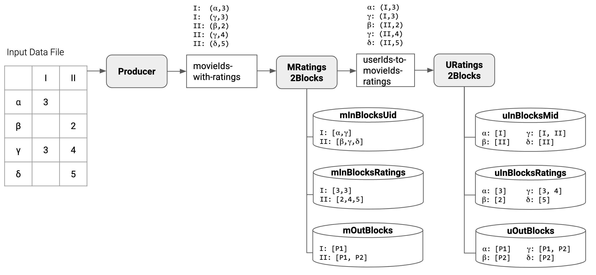
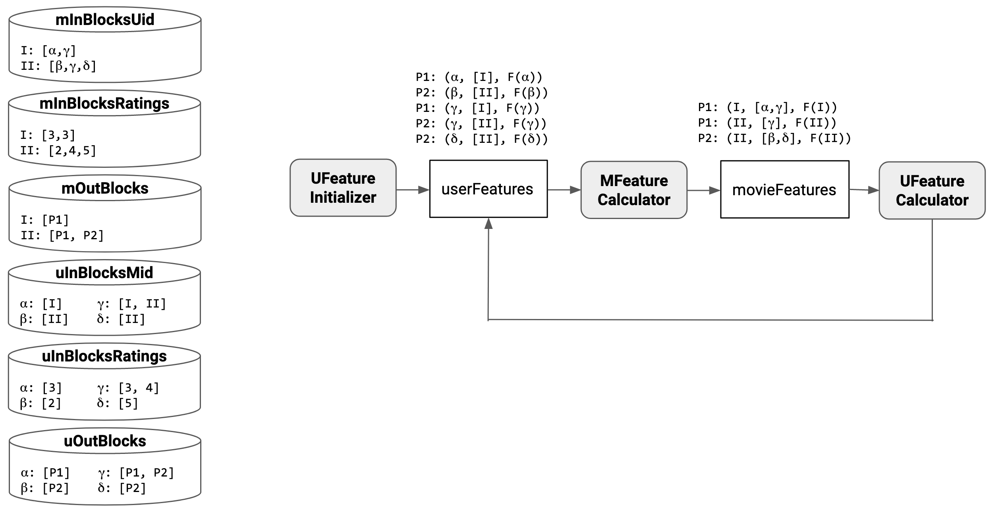
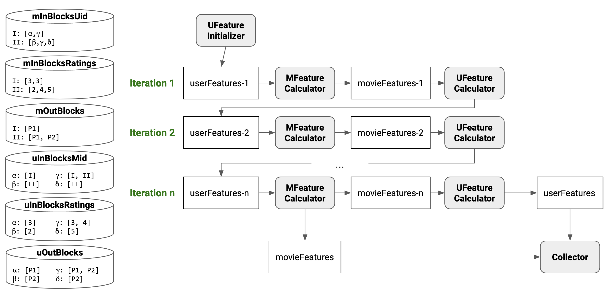

# Collaborative Filtering with Alternating Least Squares in Kafka

Collaborative filtering is a technique in which feedback from users for items (movies, songs, clothing ...) is used to predict how others users would rate these items.
This plays a major role for many companies that deal with huge user / item datasets and want to make predictions / recommendations for these users, e.g. Netflix, Spotify or Amazon.
We focus on explicit feedback, which means explicit ratings from users instead of implicit measurements like "time spent viewing item x" or mouse movements.
We use movies as an example for items throughout our project.
The problem can be imagined as a giant matrix where the users are represented by the rows and the items are represented by the columns.
Some cells contain the existing ratings, but the majority are empty (the matrix is very sparse in practice) and we want to fill these empty cells to make predictions.

We do not really streamify it too much...

RatingsMatrix | Movie1 | Movie2 | Movie1 | Movie2
--- | ---: | ---: | ---: | ---:
User1 | null | 1 | null | 5
User2 | 2 | 3 | null | null
User3 | null | null | null | 4
User4 | 2 | null | 3 | null

## Alternating Least Squares
The algorithm we implemented is called Alternating Least Squares (ALS).
Netflix once started a challenge for improving it's prediction system.
The winning solution used different approaches, but ALS was one of them.
A detailed explanation can be found in the original paper: (shorten reference here)
> Zhou, Y., Wilkinson, D., Schreiber, R., & Pan, R. (2008, June). Large-scale parallel collaborative filtering for the netflix prize. In International conference on algorithmic applications in management (pp. 337-348). Springer, Berlin, Heidelberg.

ALS tackles the problem of Collaborative Filtering by using matrix factorization.
It finds two low rank matrices (to save storage and computing power) whose multiplication approximates the original matrix and which then also contain predictions for the empty fields.
These two matrices could look like this (values aren't correct in this example):

UserFeatureMatrix | Feature1 | Feature2
--- | ---: | ---:
User1 | 1.3 | 1.5
User2 | 2.0 | 3.2
User3 | 1.5 | 0.4
User4 | 2.4 | 4.2

MovieFeatureMatrix | Feature1 | Feature2
--- | ---: | ---:
Movie1 | 2.3 | 4.5
Movie2 | 2.2 | 1.2
Movie3 | 1.0 | 3.4
Movie4 | 2.6 | 3.2

These matrices would be multiplied to get the final prediction table.

To calculate these two feature tables, ALS needs an error function.
We are using a very similar function as the one described in the paper:

We calculate the RMSE between all cells that contain ratings in the original ratings matrix and the corresponding cells of the prediction matrix.
As we are using low rank approximations, it is very unlikely that ALS will correctly "predict" the original ratings.
The paper then normalizes the RMSE with a parameter lambda and, depending on the cell, with the number of ratings of the corresponding user and movie.
In our approach, we also normalize with lambda, but depending on the step we are in (see below), we only have access to the number of ratings of the user or the movie respectively.
We only use this number to normalize in addition to lambda in contrast to both as shown above.

### Algorithm
We describe the steps of the algorithm schematically.
For the detailed mathematical explanation we refer to the paper above.

#### 0. Initialize UserFeatureMatrix
Initialize the UserFeatureMatrix with small random values in (0,1].

UserFeatureMatrix | Feature1 | Feature2
--- | ---: | ---:
User1 | 0.3 | 0.5
User2 | 0.0 | 0.2
User3 | 0.5 | 0.4
User4 | 0.4 | 0.2

#### 1. Calculate MovieFeatureMatrix
Using the error function, we calculate a closed form solution for the MovieFeatureMatrix, because the original RatingsMatrix and the UserFeatureMatrix are fixed at this point.

#### 2. Calculate UserFeatureMatrix
Now we fix the MovieFeatureMatrix and calculate the UserFeatureMatrix from the error function.

#### 3. Repeat Step 1 and 2
Experiments have shown (see paper below) that even for the largest datasets this algorithm converges in 5 - 20 repetitions of these two steps.
We set a number of iterations in the beginning and repeat accordingly.

#### 4. Calculate Predicitions
In the end, we need to calculate the FinalPredictionMatrix by multiplying the two feature matrices:

FinalPredictionMatrix = UserFeatureMatrix * MovieFeatureMatrixT

This yields an approximation of the original RatingsMatrix with predictions for the previously empty cells.

### Distributing ALS

As discussed in the section on ALS, the features of a single user/movie can be updated using a closed form solution.
Therefore, this part can be intuitively parallelized and so we focus on reducing the communication cost.
To be able to update a user's feature vector, the following data is required: a) the **ratings the user has given** to movies and b) a **movie feature sub-matrix** for the movies the user has rated.
To be more precise, this is a sub-matrix of the matrix that all movie feature vectors make up together.
The **ratings the user has given** are constant throughout the ALS process and can therefore be stored on a single node for the whole execution of the algorithm.
Therefore, it does not have to be transferred between nodes during ALS iterations.
The values of the **movie feature sub-matrix** change during execution of the algorithm towards a best-possible low-rank approximation of the original matrix.
However, the structure of this sub-matrix stays the same because the movies a user has rated stay the same during runtime.
We can use this fact to our advantage for distributing ALS.

In more detail, we create an __InBlock__ and an __OutBlock__ for every feature vector User1, User2, ..., UserN and Movie1, Movie2, ..., MovieN that we compute.
Looking at __InBlocks__ and __OutBlocks__ from the angle of a feature vector computation for a user feature vector,
each __InBlock__ stores the ratings the user has given to movies and the IDs of these movies which allows us to access these movies' feature vectors.
Each __OutBlock__ stores the IDs of movie feature vectors that depend on the currently computed user feature vector. In the case of the block-to-block join, an __OutBlock__ of a user feature vector is used to send the feature vector once per partition that contains dependent movie feature vector computations. However in the case of the more naive all-to-all join, the __OutBlock__ is not used and a user feature vectors is sent once per depending movie feature vector, even if multiple movie feature vector computations would be carried out on the same partition.
Both __InBlocks__ and __OutBlocks__ are distributed across the partitions.

### Implementation in Spark

One version of this algorithm is implemented in the Spark MLLib and makes some additional important optimizations for distributed calculation of ALS, as the data often is very large.
The current implementation is described n detail in this paper:
> Das, A., Upadhyaya, I., Meng, X., & Talwalkar, A. (2017, November). Collaborative Filtering as a Case-Study for Model Parallelism on Bulk Synchronous Systems. In Proceedings of the 2017 ACM on Conference on Information and Knowledge Management (pp. 969-977).

They take pressure of the Java garbage collector by using primitive arrays instead of tuples of integers and optimize the memory footprint of ALS by using smaller arrays and packing multiple values in a single integer.
In addition to greatly optimizing the memory consumption, the main takeaway is their approach to handling the communication of a distributed ALS approach.

// TODO

### Architecture and Dataflow in Kafka

### Benchmarks

Introduce datasets we used for evaluation (also usage or do that exclusively below?)

For evaluating our prototype, we focused on measuring the execution time on sample datasets of different sizes from the Netflix dataset. We do not compare

Compare all-to-all, block-to-block and block-to-block implementation in Spark's MLLib

hohe spark zeiten mit spark startup erklären

methodik: durchschnitt aus 10 durchläufen
5 features, 7 iterations, lambda=0,05

spark times include time for startup

The block-to-block join ALS implementation causes some overhead which results in higher execution times for extremely small datasets but has a positive effect on the execution time of big datasets.

The measured execution time for our ALS implementations (both block-to-block join and all-to-all join) includes the time it takes the producer to split the input matrix into records and sending them to the Kafka broker.

// TODO talk about biggest dataset, dropped messages\
// mention problems we overcame?\
// spark able to do way larger

## Challenges
We will outline three exemplary problems we faced during the development. Oftentimes, our biggest challenge was the missing knowledge about the inner workings of Kafka.

For a long time, we were logging information about the producer records we sent, not realising that calling `get()` after `send()` makes sending the messages a synchronous process in contrast to it being asynchronous, thus being way slower. Like other problems we faced, once we realised our mistake, it was a pretty easy fix to apply.

Another hiccup concerned the block-to-block-join algorithm we implemented. When we compared it to the all-to-all-join we realised that we weren't gaining anything from it, it oftentimes even slowed us down. After a lot of logging, debugging and digging around we stumbled upon our implementation of the creation of the OutBlocks. Instead of only putting in a partition once for every user or movie, we didn't check whether it was already in the OutBlock and so added it multiple times, multiplying the messages that were sent by our system. Once found, a simple check in the creation of the OutBlocks fixed the problem.

The hardest nut to crack was that once we tried bigger datasets, we quickly started getting lost messages and thus missing users and movies in the final prediction matrix. There were multiple issues, one being messages in the producers buffer getting too old and being dropped. This could be fixed with a more lenient configuration. Another issue concerned the partitioning. We didn't realise that we have a shuffling phase between both the MRatings2BlocksProcessor to the URatings2BlocksProcessor and the URatings2BlocksProcessor to the UFeatureInitializer where all partitions are sending messages to all partitions. There are two different ways we check for the EOF control message. The MRatings2BlocksProcessor only needs to get the EOF message once from the NetflixDataFormatProducer, because there is only one producer. But the URatings2BlocksProcessor and the UFeatureInitializer need to get it from each partition. However, we had only implemented the all partition check in the UFeatureInitializer and not the URatings2BlocksProcessor, where we only waited for one EOF message and introduced a race condition, skipping some records for bigger data. But because we had fixed this issue in the UFeatureInitializer already, finding the problem turned out being more complicated than solving it.

We are still missing some records when the datasets get bigger and can't compete with the sizes spark can handle on our machines, but we progressed a lot when it comes to speed and size compared to where we started out.

## Usage

To start the confluence kafka docker image execute the following:

`$ (cd dev && docker-compose down -v && docker-compose up)`

Wait for the broker, zookeeper and control center to be up and running. You can find the Control center at [http://0.0.0.0:9021/](http://0.0.0.0:9021/).

Run `./setup.sh NUM_PARTITIONS NUM_ITERATIONS` (e.g. `./setup.sh 4 10`) to (re)create necessary topics that are not auto-created.

Run `./gradlew run --args='NUM_PARTITIONS NUM_FEATURES LAMBDA NUM_ITERATIONS PATH_TO_DATASET NUM_MOVIES NUM_USERS'`, e.g. `./gradlew run --args='4 10 0.05 10 ./data/data_sample_tiny.txt 426 302'`.

The options for the three supplied datasets (taken from the netflix prize challenge) are:

Dataset path | NUM_MOVIES | NUM_USERS
--- | ---: | ---:
./data/data_sample_tiny.txt | 426 | 302
./data/data_sample_small.txt | 2062 | 1034
./data/data_sample_medium.txt | 3590 | 2120

## References
